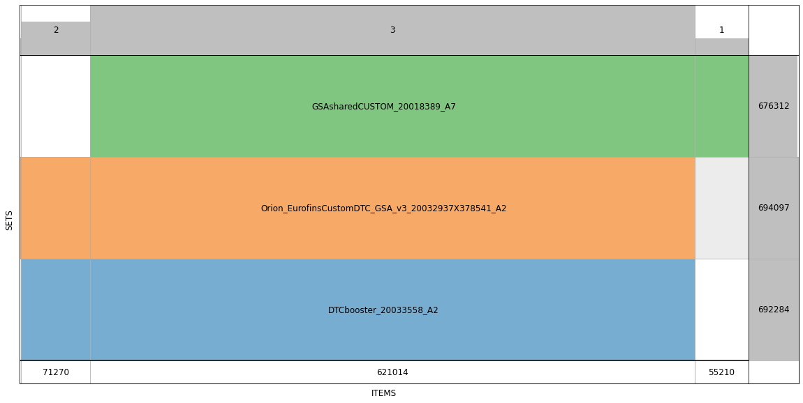
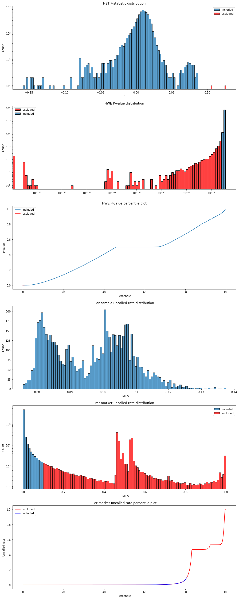
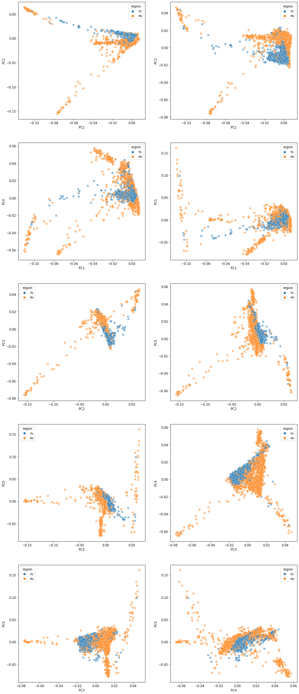
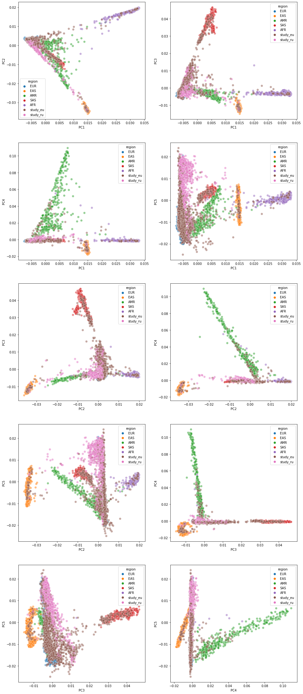

# GWAS Genetic Data Processing Description

## Data collection

### Genotyping

The input data was collected from three DNA microarrays:
1. DTCbooster_20033558_A2
2. GSAsharedCUSTOM_20018389_A7
3. Orion_EurofinsCustomDTC_GSA_v3_20032937X378541_A2

The above-mentioned microarrays were designed based on Illumina Infinium GSA v3 and had array-specific custom content of approx.
50-70K genetic markers. The intersection of microarray-specific markers is shown in the Figure 1. Note that only genetic
marker identifiers were used for intersection without marker-specific allele data. All genetic identifiers were aligned
with dbSNP build 153.

<figure>
  
  <figcaption>Figure 1. DNA Microarray Content Comparison.</figcaption>
</figure>

Microarray fluorescence was scanned using the Illumina iScan system, and the genotype calling was executed using the
Illumina IAAP Genotyping CLI v1.1 software with GRCh38.p13-based microarray manifests. The resulting `gtc` files were
converted to VCF files using `bcftools` and `gtc2vcf` plugin, followed by per-batch QC procedure.

### Per-batch QC

1. Markers from multiple mapping comments provided by Illumina for GSA v3 DNA microarrays were excluded.
2. Samples call rate was calculated using all available chromosomes except chrY, followed by exclusion of samples which
   demonstrated call rates not exceeding 0.95.
3. Genetic sex was calculated based on chrX homozygosity rate (chrX_homo) and chrY uncalled rate (chrY_uncalled):
   samples were assigned a female genetic sex when chrX_homo < 0.85 AND chrY_uncalled >= 0.5; samples were assigned
   a male genetic sex when chrX_homo >= 0.85 AND chrY_uncalled < 0.5. When either of the two conditions was not met
   by the data, the sample was excluded from analysis.
4. Per-marker call rates were calculated for each batch followed by exclusion of markers which demonstrated call rates 
   less than 0.95.
5. Heterozygous genotypes for chrM, chrY and chrX (in males) were filtered out.
6. For each marker inside each batch the observed ALT allele frequency and p-value were calculated using the
   implementation of the Exact HWE algorithm (http://csg.sph.umich.edu/abecasis/Exact/). The p-value threshold was
   adaptively calculated for each batch using the Sidak-Holm correction. Markers with p-value not exceeding 1e-6 were
   filtered out.
7. Split multiallelic sites were merged into multiallelic VCF entries using a custom algorithm implementing the SPDI
   notation.

### Sample selection

Genetic samples identifiers were selected based on a set of inclusion and exclusion criteria. These criteria are to be
finalised further. 

## Data merge and filtering

QCed VCFs from the original processing pipelines containing the selected samples were retrieved followed by VCF
subsetting using `bcftools view`. Deannotation via `bcftools annotate` was applied to reduce file size and remove
excessive VCF INFO and FORMAT data followed by trimming ALT alleles using `bcftools view --trim-alt-alleles`,
normalisation via `bcftools norm -c x` with GRCh38.p13 human reference genome and exclusion of non-SNP sites via
`bcftools view -V indels,mnps,other`. VCFs were merged into a final VCF dataset using `bcftools merge`.

## Combined QC

1. The final VCF was converted into BED-BIM-FAM trio using plink1.9 `plink --make-bed --impute-sex y-only 0 1`.
2. `--het`, `--hardy midp` and `--missing` stats were collected using plink and visualised (see Figure 2).
3. Heterozygosity statistics was used to select a list of IIDs with a HET F value exceeding 0.1, these IIDs were
   filtered out from further analysis.
4. The dataset was filtered by HWE p-value and per-marker missing rate using the thresholds of 13-6 and 0.1, respectively,
   via plink `--hwe 0.000001 midp --geno 0.1`.
5. The dataset was filtered by IBD using plink2 and a threshold of 0.015625 `--king-cutoff 0.015625`.
6. In-study PCA was performed using plink `--pca` with the results shown in Figure 3.
7. GRCh38-aligned 1000 genomes (1KG) reference panel was retrieved from
   http://ftp.1000genomes.ebi.ac.uk/vol1/ftp/data_collections/1000_genomes_project/release/20190312_biallelic_SNV_and_INDEL/
   followed by its filtering by MAC with a threshold of 5 and removing duplicated-by-ID entries. 
8. 1KG reference panel was converted to a BED-BIM-FAM trio usong plink `--make-bed --keep-allele-order --max-alleles 2
   --min-alleles 2 --rm-dup exclude-all --snps-only just-acgt --autosome` followed by selecting an intersection of
   markers between the 1KG reference panel and the study panel.
9. The intersection was used to select subsets of 1KG reference panel and a study panel, followed by merging these two
   subsets and performing pca using plink `--pca` with the results shown in Figure 4.
10. The final filtered BED-BIM-FAM dataset was converted back to VCF using plink `--recode vcf-iid --output-chr chrM
    --autosome` for autosomes and `--recode vcf-iid --output-chr chrM --chr X,XY` for chrX.

<figure>
  
  <figcaption>Figure 2. Raw dataset statistics.</figcaption>
</figure>

<figure>
  
  <figcaption>Figure 3. In-study PCA results.</figcaption>
</figure>

<figure>
  
  <figcaption>Figure 4. 1KG vs study PCA results.</figcaption>
</figure>

## Michigan server imputation

### Autosomal imputation

5798 samples were used for the imputation with 576447 markers aligned to GRCh38.p13 with the following options:

1. Reference panel — HRC r1.1 2016 (GRCh37/hg19)
2. Array Build — GRCh38/hg38
3. rsq Filter — off
4. Phasing — Eagle v2.4 
5. Population — EUR
6. Mode — Quality Control and Imputation

The QC resulted in exclusion of total 32041 markers leaving 529226 markers intact with 14980 typed-only sites.

## chrX imputation

5798 samples were used for the imputation with 15053 markers aligned to GRCh38.p13 at chrX with the following options:

1. Reference panel — HRC r1.1 2016 (GRCh37/hg19)
2. Array Build — GRCh38/hg38
3. rsq Filter — off
4. Phasing — Eagle v2.4 
5. Population — EUR
6. Mode — Imputation

The QC resulted in exclusion of total 1633 markers leaving 12895 markers intact with 479 typed-only sites.

## HLA imputation

5798 samples were used for the imputation with 41237 markers aligned to GRCh38.p13 at chr6 with the following options:

1. Reference panel — Multi-ethnic HLA Reference Panel (GRCh37/hg19)
2. Array Build — GRCh38/hg38
3. rsq Filter — off
4. Phasing — Eagle v2.4 
5. Mode — Imputation

The QC resulted in exclusion of total 148 markers leaving 6285 markers intact with 1369 typed-only sites.

## HLA imputation (4-digit)

5798 samples were used for the imputation with 41237 markers aligned to GRCh38.p13 at chr6 with the following options:

1. Reference panel — 4-Digit Multi-ethnic HLA Reference Panel v2 (GRCh37/hg19)
2. Array Build — GRCh38/hg38
3. rsq Filter — off
4. Phasing — Eagle v2.4 
5. Mode — Imputation

The QC resulted in exclusion of total 147 markers leaving 7233 markers intact with 422 typed-only sites.
